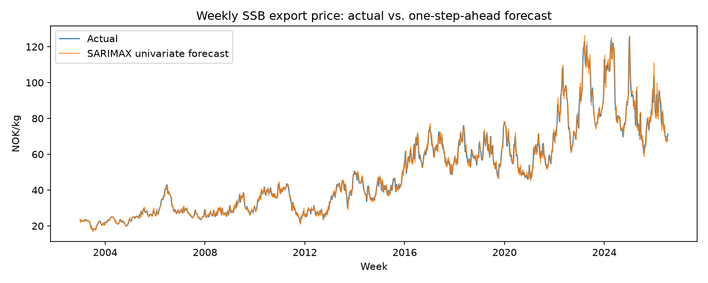
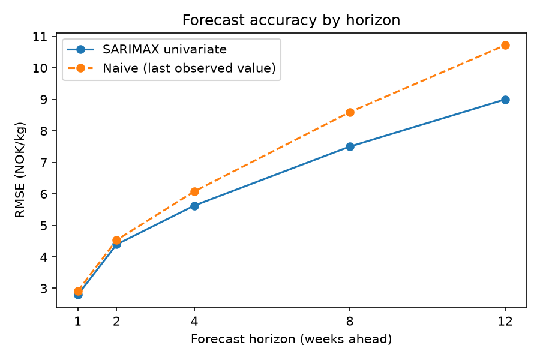
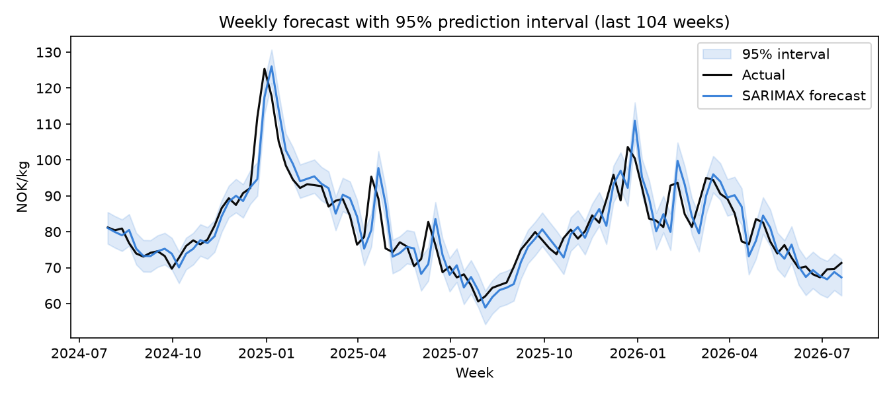
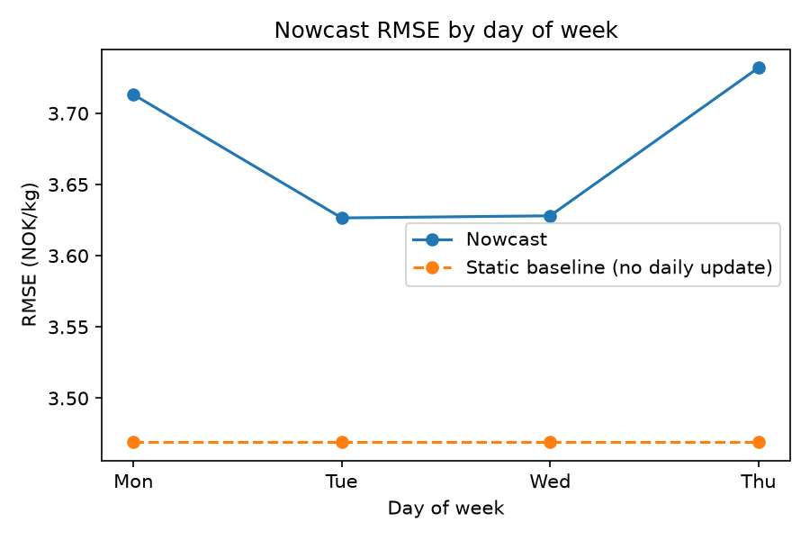
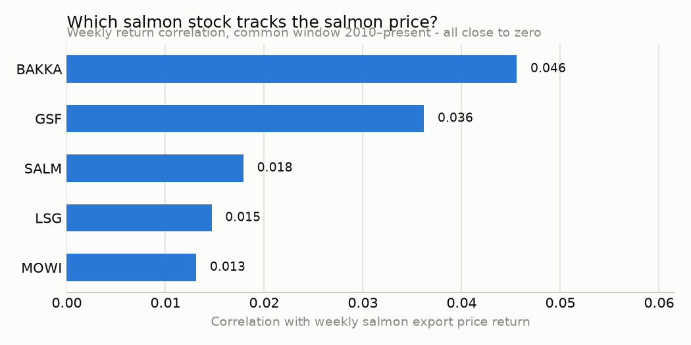

# Salmon Price Estimator

Week-ahead forecast and daily nowcast of the SSB weekly export price of
fresh Norwegian farmed salmon (NOK/kg) — published Sunday night, ahead of
the following Thursday's official print.

**Status: weekly baselines (SARIMAX, XGBoost) and the daily nowcast layer
are all built and backtested.** See "Roadmap" below and `CLAUDE.md` for
the full build log.

## Data sources

| Source | Frequency | Coverage | Used for |
|---|---|---|---|
| [SSB StatBank table 03024](https://data.ssb.no/api/v0/en/table/03024) | Weekly | 2003-present | Target variable: export price, NOK/kg |
| [NOAA OISST v2.1](https://www.ncei.noaa.gov/erddap) sea surface temp anomaly (5-point average across the farming belt) | Weekly (resampled from daily) | 2020-02-present | Exogenous feature |
| [IndexMundi](https://www.indexmundi.com/commodities/) fishmeal price | Monthly | 1996-present | Exogenous feature (feed-cost proxy) |
| NOK/USD, NOK/EUR and 5 Oslo Børs salmon stocks (MOWI, SALM, LSG, GSF, BAKKA) via [yfinance](https://github.com/ranaroussi/yfinance) | Daily | 2000/2010-present (BAKKA is the shortest) | Daily nowcast features |

All sources are fetched fresh by their own pipeline in
`src/salmon_price_estimator/data/` and landed as parquet — nothing is
committed to the repo, so the data is always reproduced from source, not
checked in. Fish Pool/Euronext salmon futures data (the fourth planned
daily input) was investigated and deferred — no free historical source
exists, see `CLAUDE.md` "Deferred items".

## Methodology

**Baseline model: SARIMAX(1,1,1)×(0,1,1,52)**, backtested with an
expanding-window walk-forward loop (`src/salmon_price_estimator/eval/backtest.py`):
fit on an initial window, forecast one week ahead, then extend the fitted
model with the newly-observed actual before forecasting the next week.
Parameters are re-estimated periodically (not every week — see
`config/model.yaml` for the runtime rationale) rather than only once,
so the model keeps adapting as more history accumulates.

Two variants are backtested side by side, not just one:

- **Univariate** — the SSB price series alone, using its full available
  history (2003-present).
- **Exogenous** — adds fishmeal price and sea-surface-temperature
  anomaly as regressors, both lagged one week before use so the model
  never sees information it wouldn't actually have at publication time
  (the forecast is made before that week's sea-temp or fishmeal data
  exists). This variant's window is shorter (2022-present) because sea
  temperature data only goes back to 2020, and the model needs a few
  years of training data before its first forecast.

A second model family, **XGBoost**, is backtested the same way but with a
rolling (not expanding) training window, retrained from scratch every
week (`eval/backtest_xgboost.py`) — cheap enough with gradient-boosted
trees on a few hundred rows that no periodic-refit shortcut is needed,
unlike SARIMAX. Rather than the raw price level, it predicts the
1-week-ahead **log-return** and reconstructs the price level from that
(`price_{t-1} * exp(predicted_return)`) — a raw-level tree model can't
extrapolate beyond the price range it was trained on, which matters on a
series that's roughly tripled since 2003. Its features
(`features/weekly_features.py`) are lagged price levels (including a
year-ago lag for seasonality), lagged log-returns, rolling mean/std, and
week-of-year sin/cos — all built from information already known at
forecast time, same leakage discipline as the SARIMAX exogenous variant.

Both model families are backtested as **autoregressive/univariate** (full
available history) and **exogenous** (+ fishmeal and sea-temp, truncated
to ~2020-present) variants — four backtests in total, all compared
against the same **naive benchmark**: predict next week's price as this
week's price. Metrics: MAPE, RMSE, and directional accuracy (did the
forecast get the sign of the week-over-week move right?).

**Daily nowcast** (`eval/backtest_nowcast.py`): anchored on the
univariate SARIMAX forecast (the model that actually beats naive), and
corrected daily Monday-Thursday using FX and Oslo Børs salmon-stock
5-day returns as the week progresses toward Thursday's official release.
The model predicts a **log-ratio correction** on top of the baseline
(`log(actual / baseline_forecast)`, reconstructed as
`baseline_forecast * exp(predicted_correction)`) rather than the raw
price level — the same "predict a transform, reconstruct the level"
pattern as the weekly XGBoost model, just applied to a correction instead
of a return. It retrains once per completed week on a 104-week rolling
window (not 4x per week — see the module docstring for why that's
provably equivalent, not a shortcut) and is compared against **holding
the baseline flat all week** (no daily updating at all), to check whether
updating on daily data helps at all.

## Headline result



| Variant | Weeks backtested | Date range | MAPE | RMSE | Directional accuracy | vs. naive (Diebold-Mariano) |
|---|---|---|---|---|---|---|
| **SARIMAX univariate** | 1,230 | 2003 – 2026 | **3.54%** (naive: 3.59%) | **2.79** (naive: 2.91) | **58.9%** (naive: 0.5%) | **significantly better** (p = 0.019) |
| SARIMAX exogenous | 230 | 2022 – 2026 | 4.96% (naive: 4.29%) | 5.84 (naive: 5.14) | 54.3% (naive: 0.0%) | significantly **worse** (p = 0.032) |
| XGBoost autoregressive | 1,126 | 2004 – 2026 | 3.92% (naive: 3.75%) | 3.11 (naive: 3.04) | 54.8% (naive: 0.4%) | no significant difference (p = 0.368) |
| XGBoost exogenous | 178 | 2023 – 2026 | 4.50% (naive: 4.31%) | 5.32 (naive: 5.26) | 55.1% (naive: 0.0%) | no significant difference (p = 0.840) |

**Only the univariate SARIMAX beats naive on all three criteria — and
that edge is statistically real, not a lucky point estimate.** A
[Diebold-Mariano test](https://en.wikipedia.org/wiki/Diebold%E2%80%93Mariano_test)
(`eval/significance.py`, squared-error loss, Harvey-Leybourne-Newbold
small-sample correction) on the two forecast-error series confirms the
3.54%-vs-3.59% MAPE gap is significant at the 5% level (p = 0.019), not
noise. The other three results get more nuanced with a significance test
applied, rather than less: the **SARIMAX exogenous variant is
significantly *worse* than naive** (p = 0.032 — this isn't just a worse
point estimate, it's a real effect), while **both XGBoost variants are
statistically indistinguishable from naive** (p = 0.37 and 0.84) — not
proven worse, just not proven better either. Every variant comfortably
beats naive on directional accuracy, though, since the naive forecast is
structurally incapable of ever predicting a price move (it just repeats
the last value).

This is a genuinely useful negative result, not a disappointing one: it
shows the naive "last observed value" benchmark is a legitimately hard
target on this series (see "Is this actually a random walk?" below for
what that claim precisely means), and that model sophistication doesn't
automatically buy accuracy here.

**One more check, since it's cheap now that both backtests exist: does
averaging SARIMAX's and XGBoost's predictions help?** Not clearly.

| Variant | Weeks | MAPE | RMSE | Directional accuracy | vs. naive (DM) | vs. SARIMAX alone (DM) |
|---|---|---|---|---|---|---|
| Ensemble (SARIMAX + XGBoost avg) | 1,126 | 3.66% (naive: 3.75%) | 2.92 (naive: 3.04) | 57.5% (naive: 0.4%) | not significant (p = 0.060) | not significant (p = 0.733) |

The ensemble's p-value against naive (0.060) is the closest of any
non-SARIMAX-univariate variant to conventional significance — closer
than either XGBoost variant alone — but it doesn't clear the 5%
threshold, and more importantly it's statistically indistinguishable
from just using SARIMAX by itself. No evidence here that blending in
XGBoost buys anything over the simpler choice; the classic "forecast
combination" bet (a weak model can still reduce a strong one's variance
when averaged in) doesn't pay off on this series.

## Does the edge grow at longer horizons?



Every result so far is one week ahead. Naive (repeat the last observed
value) structurally ignores trend, so it should get *worse* as a
benchmark the further out you forecast — this was the one open question
in the whole project that could genuinely change the story rather than
add another confirmation of it. Tested by extending the univariate
SARIMAX (the one model that already won) to 2/4/8/12 weeks ahead, same
walk-forward mechanics, scoped to this one model deliberately (XGBoost
would need a riskier recursive feature-reconstruction loop, not worth it
for this check).

| Horizon | SARIMAX MAPE | Naive MAPE | SARIMAX RMSE | Naive RMSE | SARIMAX dir. acc. | Naive dir. acc. | Significant? (DM) |
|---|---|---|---|---|---|---|---|
| 1 week | 3.54% | 3.59% | 2.79 | 2.91 | 58.9% | 0.5% | yes (p = 0.019) |
| 2 weeks | 5.44% | 5.53% | 4.39 | 4.53 | 59.8% | 0.2% | borderline (p = 0.067) |
| 4 weeks | 6.99% | 7.34% | 5.63 | 6.08 | 62.8% | 0.2% | yes (p = 0.0024) |
| 8 weeks | 9.57% | 10.77% | 7.50 | 8.59 | 66.1% | 0.08% | yes (p = 0.0008) |
| 12 weeks | 11.64% | 13.30% | 9.00 | 10.72 | 69.9% | 0.08% | yes (p = 0.0005) |

**This is the one result in the whole project that shifts the story
rather than re-confirming it: SARIMAX's edge over naive doesn't stay
thin — it widens substantially with horizon.** The MAPE gap grows from
0.05 points at 1 week to 1.66 points at 12 weeks (a >30x increase in the
raw gap); the RMSE gap widens from 0.12 to 1.72 over the same span. SARIMAX's
directional accuracy climbs from 58.9% to 69.9% as the horizon lengthens,
while naive's stays pinned near zero throughout (it structurally can
almost never predict a move, at any horizon). Statistical significance
holds at every horizon except a borderline dip at 2 weeks (p = 0.067,
just short of 5%) — and from 4 weeks on, the p-values keep shrinking as
the horizon grows, the opposite of what you'd expect if the 1-week edge
were a fluke that fades with more uncertainty.

**Why this makes sense, not just a lucky number:** naive's blind spot is
trend — it can never anticipate a persistent multi-week drift, no matter
how obvious, because it always just repeats the last value. That blind
spot costs more the further out you forecast: missing a trend over 12
weeks is a much bigger miss than missing it over 1 week. SARIMAX, through
its differencing and AR/MA structure, captures some of that dynamic, so
its relative advantage compounds with horizon even as its *absolute*
error also grows (3.5% MAPE at 1 week is still better than 11.6% at 12
weeks in absolute terms — forecasting further out is harder for both
models). What grows is the *edge*, not the accuracy in isolation, and
the edge is what a forecaster is actually judged against.

## Why the exogenous features and XGBoost didn't help — and what that does and doesn't mean

The SARIMAX exogenous variant's shortfall was investigated in detail
(full write-up in `CLAUDE.md`'s session log, 2026-09-03):

- Restricting the **univariate** SARIMAX to the exact same 230 weeks the
  exogenous variant was evaluated on, it *still* beats naive (MAPE 4.17%
  vs. 4.29%) — so it isn't just "recent years are harder to forecast."
- A control backtest — same short 2022+ window, same SARIMAX order, but
  with the exogenous regressors removed — *also* underperforms naive
  (MAPE 4.54%). The short window, forced by sea-temperature data only
  existing from 2020 onward, isn't long enough to reliably fit this
  model's annual seasonal component (the seasonal MA coefficient sits at
  its numerical boundary with an enormous standard error).
- The two exogenous coefficients themselves are statistically
  indistinguishable from zero in a full-sample fit (p = 0.95 and p =
  0.53) — consistent with there being essentially no linear relationship
  between *changes* in price and the *level* of either regressor, even
  though the raw level-to-level correlations look deceptively strong (a
  classic artifact of comparing two trending series).

XGBoost was built specifically to give these features a fairer test,
since it doesn't need an explicit parametric seasonal term the way
SARIMAX does. The result: XGBoost's exogenous variant (4.50% MAPE) comes
much closer to naive than SARIMAX's did (4.96%) — the gap shrank by
roughly two-thirds — and a feature-importance check on the fitted model
confirms `fishmeal_price_usd_per_tonne` and `sst_anomaly_c` aren't dead
weight (they rank mid-pack among all 14 features, not last). So XGBoost
*does* extract some real signal from them. And per the Diebold-Mariano
test above, XGBoost's shortfall (both variants) **isn't even
statistically distinguishable from naive** — a materially different, and
more defensible, position than SARIMAX-X's, which is significantly worse.

**Conclusion**: this isn't "fishmeal and sea temperature are useless" or
"XGBoost failed" — it's "the exogenous features carry weak signal,
XGBoost extracts a bit more of it than a linear model can (enough to turn
a significant loss into statistical noise, even if not into a win), and
neither approach clears naive on this particular series." The honest
headline model remains the univariate SARIMAX.

## How reliable are these forecasts, not just how accurate?



Every result above is a point forecast. A point forecast alone doesn't
say how much to trust it, so each variant also gets a **95% prediction
interval** — SARIMAX's is native (statsmodels' `conf_int`, the model's
own state-space uncertainty estimate); XGBoost has no native equivalent,
so it gets an **empirical interval** instead (`eval/prediction_intervals.py`):
the point forecast ± the trailing 104 weeks' realized-residual quantiles,
using only residuals from *before* that forecast, no look-ahead. Then
both get the same check: **does the stated interval actually contain the
true value ~95% of the time** (`data/processed/interval_coverage.csv`)?

| Variant | Interval type | Coverage (nominal 95%) | Median width | Mean width |
|---|---|---|---|---|
| SARIMAX univariate | native (conf_int) | **76.7%** — undercovers | 4.7 NOK/kg | 23,145 NOK/kg (!) |
| SARIMAX exogenous | native (conf_int) | 89.1% | 18.9 NOK/kg | 2.1 billion NOK/kg (!!) |
| XGBoost autoregressive | empirical (residual quantiles) | 90.6% | 9.3 NOK/kg | 10.6 NOK/kg |
| XGBoost exogenous | empirical (residual quantiles) | **94.4%** | 20.9 NOK/kg | 20.9 NOK/kg |

This is a real finding, checked carefully before writing it down (the
absurd mean widths are not a bug — see below) — and it runs the same
direction as everything else in this project: **the theoretically
"proper" approach isn't automatically the reliable one.**

- **SARIMAX univariate's intervals are consistently too narrow** — 76.7%
  actual coverage against a stated 95%, not a one-off. The chart above
  shows why: the actual price visibly pokes outside the shaded band
  repeatedly. The likely cause is the same runtime tradeoff documented
  for this variant's `refit_every_n_weeks=52` (annual refit, chosen
  because more frequent refits would have pushed the backtest past 2
  hours) — the model's uncertainty estimate only updates once a year,
  so it can't keep pace with a series whose volatility has risen sharply
  since ~2022 (visible in the headline chart earlier). The median width
  (4.7 NOK/kg) looks reasonable in isolation; it's just too narrow too
  often given how much the series actually moves now.
- **SARIMAX exogenous's intervals occasionally become numerically
  vacuous** — most of the time the width is sane (median 18.9 NOK/kg),
  but a handful of refits during the walk-forward loop produce an
  interval **billions of NOK/kg wide** (on a series that trades between
  15 and 125 NOK/kg), dragging the mean to 2.1 billion. This traces
  directly to the already-diagnosed problem with this variant: the
  seasonal MA coefficient sits at its numerical boundary with an
  enormous standard error in a full-sample fit (see "Why the exogenous
  features and XGBoost didn't help" above) — during the walk-forward
  loop, on a short 2020+ window, some individual refits hit that same
  instability and the resulting interval becomes meaningless rather than
  merely wrong.
- **XGBoost's simpler empirical intervals turned out to be the more
  trustworthy ones** — both variants land close to their nominal 95%
  (90.6%, 94.4%), and by construction (point forecast ± a quantile of
  recent real residuals) they can't produce a nonsensical result the way
  a parametric interval can when the underlying model is poorly
  identified.

**Conclusion**: this isn't an argument that XGBoost is the better model
overall — on point-forecast accuracy, univariate SARIMAX still wins
clearly (see above). It's that *uncertainty quantification* is a
separate question from point-forecast accuracy, worth checking
separately rather than assuming a textbook-correct-looking interval is
automatically a reliable one. If this project's forecasts were ever used
for an actual decision (e.g. sizing a hedge), the empirical-interval
approach would be the safer one to trust, precisely because it can't
silently fail the way the parametric one did here.

## Does the directional edge translate into economic value?

Every result so far has been a statistical metric (MAPE, RMSE,
Diebold-Mariano p-values). None of them directly answer the more
practical question a trading or hedging desk would actually ask: **if
you'd acted on this model's calls, would it have made money?**

A simple notional long/short strategy (`eval/trading_strategy.py`): go
long for the week if the model predicted a rise, short if it predicted a
fall, and realize that week's actual return with that sign. This is a
**paper exercise, not a claim about a real tradable strategy** — the SSB
export price is a statistical index, not a security, and this ignores
transaction costs and any capital/margin constraints entirely. What it
*does* cleanly test is whether the directional edge already reported as
"directional accuracy" is worth anything once you weight it by the size
of the moves, and whether that's statistically distinguishable from
chance (a Newey-West HAC test on the strategy's mean weekly return,
since — per the random-walk section below — these returns are
autocorrelated, so a naive t-test would understate the uncertainty).

| Variant | Hit rate | Strategy ann. return | Strategy Sharpe | Significant? (Newey-West) | Buy & hold ann. return (same window) |
|---|---|---|---|---|---|
| SARIMAX univariate | 58.9% | 53.9% | 1.65 | **yes** (p = 1.0×10⁻¹⁵) | 4.7% |
| SARIMAX exogenous | 54.3% | 46.7% | 1.17 | **yes** (p = 0.0036) | -4.7% |
| XGBoost autoregressive | 54.8% | 34.3% | 1.00 | **yes** (p = 2.6×10⁻⁶) | 5.1% |
| XGBoost exogenous | 55.1% | 54.5% | 1.36 | borderline (p = 0.052) | -13.3% |
| Ensemble | 57.5% | 52.0% | 1.53 | **yes** (p = 2.1×10⁻¹³) | 5.1% |

The genuinely interesting wrinkle: **every variant shows a statistically
significant (or borderline) positive average strategy return — including
the two XGBoost variants whose point forecasts were *not* significantly
different from naive.** That's not a contradiction of the earlier
Diebold-Mariano results, it's a different question getting a different
answer: beating naive on *average squared error* and having a
*directionally profitable signal* aren't the same test, and a model can
fail the first while passing the second. A hit rate of ~55% sounds
unimpressive, but weighted by the size of each week's move and measured
over hundreds of weeks, it's enough for the Newey-West test to detect —
which also means: don't over-read this as "the models are secretly great
after all." A large sample size makes even a modest, already-known
directional edge easy to detect as "statistically real" — this table
quantifies that edge in P&L terms, it doesn't uncover a new one.

Worth noting in the same breath: buy-and-hold's return over the
shorter, more recent, exogenous-variant windows was **negative**
(-4.7%, -13.3% annualized) — 2022+ has been a genuinely rough stretch
for just holding exposure to this series. A directional strategy with
even a modest edge and the ability to go short, not just long, avoided
that entirely and posted a significant positive return over the same
stretch. That's arguably the most economically relevant single fact in
this section.

## Is this actually a random walk?

"Behaves close to a random walk" has been stated qualitatively so far —
worth testing formally rather than leaving it as a hand-wave
(`eval/random_walk_test.py`), and the answer turned out more precise
than the informal version, not just confirmed:

| Test | Statistic | p-value | Conclusion |
|---|---|---|---|
| ADF (log price level) | -1.58 | 0.49 | Unit root **not rejected** — consistent with a non-stationary, trending price level |
| Ljung-Box, weekly returns (lags 1/4/12/52) | 40–250 | all < 10⁻⁹ | **Rejects** "no autocorrelation" at every lag |

Put together, this is **not a pure random walk** — a true random walk's
week-to-week changes would be unpredictable, and the Ljung-Box test would
fail to reject at every lag. It doesn't. Weekly returns have real,
statistically detectable autocorrelation. The price level *is*
non-stationary (the ADF result, the necessary-but-not-sufficient half of
"random walk"), but its changes aren't pure noise.

That combination — non-stationary *and* weakly autocorrelated — is, not
coincidentally, exactly what SARIMAX(1,1,1)×(0,1,1,52) is built to
capture: the AR/MA terms exist specifically to model autocorrelation in
the differenced series. **That's why SARIMAX can extract a statistically
significant edge over naive at all** (the Diebold-Mariano result above).
At the 1-week horizon the edge is thin (3.54% vs. 3.59% MAPE) — telling
you the autocorrelation, while real, is subtle week-to-week. "Close to a
random walk" was the right intuition; "non-stationary with weak but real
autocorrelation" is the more precise description these two tests actually
support. It's also consistent with the edge *widening* substantially at
longer horizons (see "Does the edge grow at longer horizons?" below) —
a thin week-to-week autocorrelation compounds into a much more
exploitable trend-following advantage the further out you forecast, even
though it's barely detectable one week at a time.

## Daily nowcast result



| Day | Weeks | Nowcast RMSE | Static baseline RMSE (no daily update) | vs. static (Diebold-Mariano) |
|---|---|---|---|---|
| Mon | 747 | 3.71 | 3.47 | significantly worse (p = 0.030) |
| Tue | 747 | 3.63 | 3.47 | significantly worse (p = 0.050) |
| Wed | 747 | 3.63 | 3.47 | significantly worse (p = 0.029) |
| Thu | 747 | 3.73 | 3.47 | significantly worse (p < 0.001) |

This is a third instance of the same pattern as above, and it's reported
just as plainly: **the nowcast doesn't beat the static baseline on any
day**, and RMSE doesn't decline monotonically Mon → Thu either (it dips
Tue/Wed, then rises again Thursday). The Diebold-Mariano test confirms
this isn't noise — the underperformance is statistically significant
every single day, and, notably, **gets more significant as the week
progresses** (Thursday's p-value is two orders of magnitude smaller than
Monday's) even though the RMSE gap itself doesn't move monotonically.
Daily FX moves and Oslo Børs salmon-stock returns turn out to be a fairly
indirect, noisy proxy for the actual weekly export-price surprise —
equity prices for these companies reflect a lot more than just the spot
salmon price (forward earnings expectations, general market moves,
company-specific news), and a feature-importance check on the fitted
model shows no single daily feature dominates (importances span a narrow
0.008–0.018 range), the same diffuse-signal pattern seen in the weekly
exogenous features.

**Taken together with the weekly results above, this project's honest
finding is a coherent one, not three unrelated disappointments**: the
naive last-observed-value benchmark is a genuinely tough target on this
series at the 1-week horizon (non-stationary with only weak, thin
autocorrelation — see "Is this actually a random walk?" above), and every
attempt to beat it with more data or more model flexibility (exogenous
features, XGBoost, daily nowcasting, even a simple SARIMAX+XGBoost
ensemble) came up short against it there. The univariate SARIMAX remains
the one model in this project that clears the bar at 1 week — and, as it
turns out, clears it by a growing margin at longer horizons too (see
"Does the edge grow at longer horizons?" below), which is the one place
this project's story genuinely improves rather than just holds steady.

## Side analysis: which salmon stock tracks the salmon price?



A natural follow-up question, and one the daily-market data already
answers (`scripts/analyze_stock_correlations.py`, not part of the core
backtest pipeline): of the 5 Oslo Børs salmon-farming stocks, which one's
weekly return co-moves most with the salmon export price's own weekly
move? Same-week correlation, all 5 compared over an identical window
(2010–present, since BAKKA's 2010 listing bounds it):

| Stock | Correlation | R² |
|---|---|---|
| **BAKKA** (Bakkafrost) | 0.046 | 0.2% |
| **GSF** (Grieg Seafood) | 0.036 | 0.1% |
| SALM (SalMar) | 0.018 | 0.03% |
| LSG (Lerøy Seafood) | 0.015 | 0.02% |
| MOWI (Mowi) | 0.013 | 0.02% |

The ranking itself is a minor, plausible detail — Bakkafrost and Grieg
Seafood are more concentrated, vertically-integrated pure-plays; Mowi,
the largest and most diversified, dilutes pure spot-price sensitivity
across feed, VAP, and international operations. **The real finding is
that every correlation is close to zero** — even the top stock's weekly
return has salmon price explaining only 0.2% of its variance. Stock
prices are forward-looking (pricing in *expected future* margins, not
this week's realized export price) and these companies hedge via forward
contracts, so this isn't surprising in hindsight — but it does explain,
from the other direction, why the daily nowcast above (which leans on
these same 5 stocks' returns) struggled: if salmon-company equities
barely track the salmon spot price even in the *same* week, they were
never going to be a strong predictor of it.

## Reproducing these results

```bash
uv sync
uv run python scripts/run_backtest.py
```

This fetches all data sources if they're not already cached locally,
builds the joined weekly panel/features, runs all four weekly backtest
variants (with prediction intervals) plus the ensemble, the multi-step
SARIMAX backtest, and the daily nowcast backtest, writes
`data/processed/backtest_*.parquet`, `data/processed/backtest_metrics.csv`,
`data/processed/significance_tests.csv` (the Diebold-Mariano results
above), `data/processed/random_walk_tests.csv` (the ADF/Ljung-Box
results), `data/processed/interval_coverage.csv` (the calibration table
above), `data/processed/trading_strategy.csv` (the economic-value table
above), `data/processed/backtest_multistep.parquet`,
`data/processed/multistep_metrics.csv`, and
`data/processed/multistep_significance.csv` (the horizon results above),
and regenerates all four chart images under `assets/`. **A fresh run
takes roughly 55-60 minutes** — SARIMAX refit cost scales superlinearly
with training window size on this ~1,300-week series (see
`config/model.yaml` and `eval/backtest.py` for the measured numbers and
the runtime tradeoffs that shaped the default config); the multi-step
backtest refits its own independent SARIMAX state sequence (it can't
reuse the 1-step backtest's cached fits) so it adds another ~15-17
minutes on top of the four-variant total; XGBoost and the nowcast layer
add only a few more minutes since retraining them is cheap. Each
variant's results are cached under `data/processed/` and skipped on
subsequent runs unless deleted, so an interrupted run resumes rather
than starting over — note that adding prediction intervals changed the
SARIMAX result schema, so those two cache files needed a one-time
deletion to pick up the new `lower`/`upper` columns.

Unlike everything else in `data/processed/` (gitignored, regenerated on
demand), all five PNGs under `assets/` (four from this script, plus the
stock-correlation chart below) **are committed** — they're the artifacts
this README embeds directly, so they need to actually be in the repo
rather than regenerated-and-ignored. Re-run the relevant script and
commit the updated PNGs if the underlying results change.

The stock-correlation side analysis is a separate, optional script (it
isn't part of the core forecasting pipeline, so it isn't in
`run_backtest.py`):

```bash
uv run python scripts/analyze_stock_correlations.py
```

## Roadmap

- [x] SSB export price target pipeline
- [x] Sea surface temperature and fishmeal exogenous feature pipelines
- [x] SARIMAX weekly baseline (univariate + exogenous), walk-forward backtest
- [x] XGBoost weekly baseline (autoregressive + exogenous), rolling-window backtest
- [x] Daily nowcast layer (FX + Oslo Børs salmon stocks; futures deferred, see below)
- [x] Multi-step-ahead SARIMAX backtest (1/2/4/8/12 weeks, univariate only)
- [ ] Fish Pool/Euronext salmon futures (deferred — no free historical
      source, see `CLAUDE.md` "Deferred items")
- [ ] Harvest volume / standing biomass features (deferred — needs
      BarentsWatch API registration, see `CLAUDE.md`)

## Development

```bash
uv sync
uv run python -m pytest
uv run ruff check .
```

A `Dockerfile` is also provided (`docker build -t salmon-price-estimator .`
then `docker run salmon-price-estimator`, which runs
`scripts/run_backtest.py`) — **not build-tested**, since Docker isn't
available in this project's development environment. It's driven by
`uv.lock` so it should pick up all dependencies automatically, and
includes `libgomp1` for xgboost's OpenMP dependency, but treat it as
best-effort until someone actually runs it.
